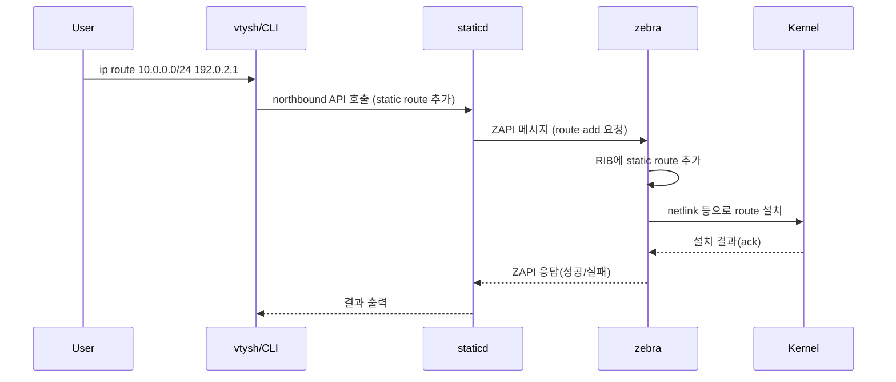
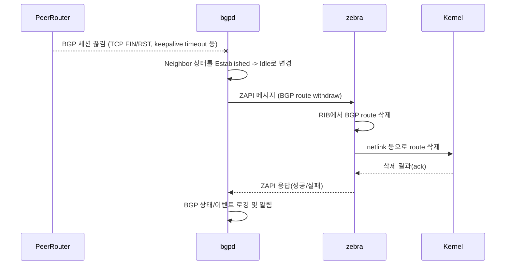

Frr seq diagram

```mermaid
sequenceDiagram
    participant User
    participant main
    participant frr_preinit
    participant frr_opt_add
    participant frr_getopt
    participant frr_init
    participant libagentx_init
    participant zebra_router_init
    participant zserv_init
    participant zebra_rib_init
    participant zebra_if_init
    participant zebra_debug_init
    participant zserv_open
    participant zebra_ns_init
    participant router_id_cmd_init
    participant zebra_vty_init
    participant mgmt_be_client_create
    participant access_list_init_new
    participant prefix_list_init
    participant rtadv_init
    participant rtadv_cmd_init
    participant zebra_ptm_init
    participant zebra_mpls_init
    participant zebra_mpls_vty_init
    participant zebra_pw_vty_init
    participant zebra_pbr_init
    participant zebra_opaque_init
    participant zebra_srte_init
    participant zebra_srv6_init
    participant zebra_srv6_vty_init
    participant frr_config_fork
    participant getpid
    participant zebra_dplane_start
    participant zebra_opaque_start
    participant label_manager_init
    participant zebra_rnh_init
    participant zebra_evpn_init
    participant zebra_error_init
    participant frr_run

    User->>main: 실행
    main->>frr_preinit: frr_preinit(&zebra_di, argc, argv)
    main->>frr_opt_add: frr_opt_add(...)
    loop 옵션 파싱
        main->>frr_getopt: frr_getopt(...)
    end
    main->>frr_init: zrouter.master = frr_init()
    main->>libagentx_init: libagentx_init()
    main->>zebra_router_init: zebra_router_init(...)
    main->>zserv_init: zserv_init()
    main->>zebra_rib_init: zebra_rib_init()
    main->>zebra_if_init: zebra_if_init()
    main->>zebra_debug_init: zebra_debug_init()
    main->>zserv_open: zserv_open(zserv_path)
    main->>zebra_ns_init: zebra_ns_init()
    main->>router_id_cmd_init: router_id_cmd_init()
    main->>zebra_vty_init: zebra_vty_init()
    main->>mgmt_be_client_create: mgmt_be_client_create(...)
    main->>access_list_init_new: access_list_init_new(true)
    main->>prefix_list_init: prefix_list_init()
    main->>rtadv_init: rtadv_init()
    main->>rtadv_cmd_init: rtadv_cmd_init()
    main->>zebra_ptm_init: zebra_ptm_init()
    main->>zebra_mpls_init: zebra_mpls_init()
    main->>zebra_mpls_vty_init: zebra_mpls_vty_init()
    main->>zebra_pw_vty_init: zebra_pw_vty_init()
    main->>zebra_pbr_init: zebra_pbr_init()
    main->>zebra_opaque_init: zebra_opaque_init()
    main->>zebra_srte_init: zebra_srte_init()
    main->>zebra_srv6_init: zebra_srv6_init()
    main->>zebra_srv6_vty_init: zebra_srv6_vty_init()
    main->>frr_config_fork: frr_config_fork()
    main->>getpid: zebra_pid = getpid()
    main->>zebra_dplane_start: zebra_dplane_start()
    main->>zebra_opaque_start: zebra_opaque_start()
    main->>label_manager_init: label_manager_init()
    main->>zebra_rnh_init: zebra_rnh_init()
    main->>zebra_evpn_init: zebra_evpn_init()
    main->>zebra_error_init: zebra_error_init()
    main->>frr_run: frr_run(zrouter.master)
```

```mermaid
sequenceDiagram
    participant User
    participant vtysh/CLI
    participant staticd
    participant zebra
    participant Kernel

    User->>vtysh/CLI: ip route 10.0.0.0/24 192.0.2.1
    vtysh/CLI->>staticd: northbound API 호출 (static route 추가)
    staticd->>zebra: ZAPI 메시지 (route add 요청)
    zebra->>zebra: RIB에 static route 추가
    zebra->>Kernel: netlink 등으로 route 설치
    Kernel-->>zebra: 설치 결과(ack)
    zebra-->>staticd: ZAPI 응답(성공/실패)
    staticd-->>vtysh/CLI: 결과 출력
```

```mermaid
sequenceDiagram
    participant PeerRouter
    participant bgpd
    participant zebra
    participant Kernel

    PeerRouter--x bgpd: BGP 세션 끊김 (TCP FIN/RST, keepalive timeout 등)
    bgpd->>bgpd: Neighbor 상태를 Established -> Idle로 변경
    bgpd->>zebra: ZAPI 메시지 (BGP route withdraw)
    zebra->>zebra: RIB에서 BGP route 삭제
    zebra->>Kernel: netlink 등으로 route 삭제
    Kernel-->>zebra: 삭제 결과(ack)
    zebra-->>bgpd: ZAPI 응답(성공/실패)
    bgpd->>bgpd: BGP 상태/이벤트 로깅 및 알림
```
