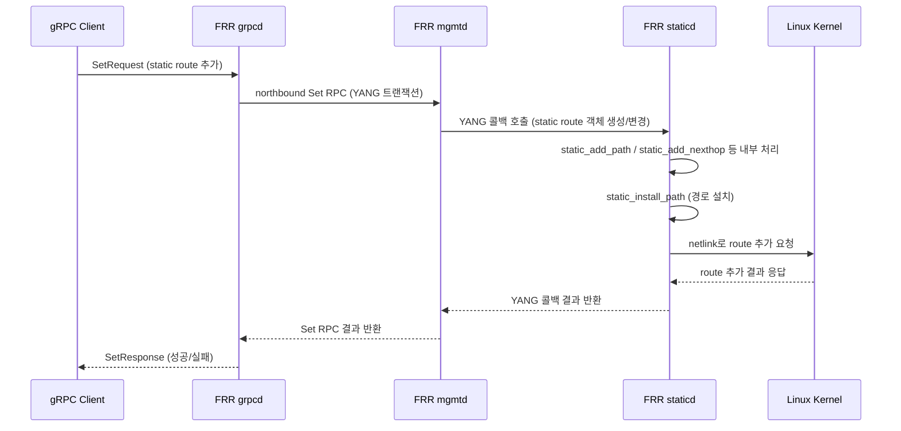
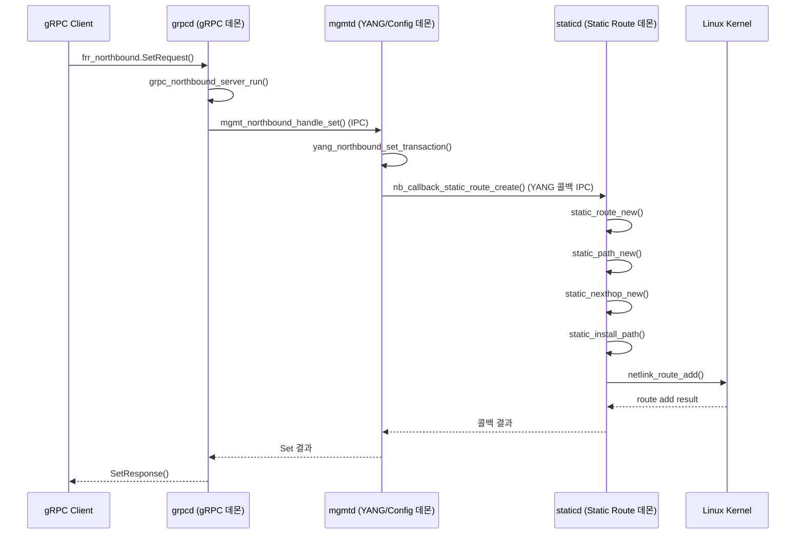

gPRC sequence diagram




client example
```c
#include <stdio.h>
#include <stdlib.h>
#include <string.h>
#include <grpc/grpc.h>
#include <grpc/byte_buffer.h>
#include <grpc/support/log.h>
#include "frr-northbound.pb-c.h" // protoc-c로 생성된 헤더

#define FRR_GRPC_SERVER "localhost:50051"

// gRPC 및 protobuf-c 초기화/종료는 main에서 처리

// 1. CreateCandidate
uint32_t create_candidate(Frr__Northbound__Stub *stub) {
    Frr__CreateCandidateRequest req = FRR__CREATE_CANDIDATE_REQUEST__INIT;
    Frr__CreateCandidateResponse *resp = frr__northbound__create_candidate(stub, NULL, &req, NULL);
    if (!resp) {
        fprintf(stderr, "CreateCandidate RPC failed\n");
        exit(1);
    }
    uint32_t candidate_id = resp->candidate_id;
    frr__create_candidate_response__free_unpacked(resp, NULL);
    return candidate_id;
}

// 2. EditCandidate (PathValue[]로 설정)
void edit_candidate_static_route(Frr__Northbound__Stub *stub, uint32_t candidate_id) {
    Frr__EditCandidateRequest req = FRR__EDIT_CANDIDATE_REQUEST__INIT;
    req.candidate_id = candidate_id;

    Frr__PathValue static_route = FRR__PATH_VALUE__INIT;
    static_route.path = "/frr-staticd:staticd/vrf[name='default']/address-family[ip='ipv4']/routes/route[prefix='10.1.1.0/24']/nexthop";
    static_route.value = "7.7.7.7";

    req.n_update = 1;
    Frr__PathValue *updates[1] = { &static_route };
    req.update = updates;

    Frr__EditCandidateResponse *resp = frr__northbound__edit_candidate(stub, NULL, &req, NULL);
    if (!resp) {
        fprintf(stderr, "EditCandidate (static route) RPC failed\n");
        exit(1);
    }
    frr__edit_candidate_response__free_unpacked(resp, NULL);
}

void edit_candidate_bgp(Frr__Northbound__Stub *stub, uint32_t candidate_id) {
    Frr__EditCandidateRequest req = FRR__EDIT_CANDIDATE_REQUEST__INIT;
    req.candidate_id = candidate_id;

    Frr__PathValue bgp_as = FRR__PATH_VALUE__INIT;
    bgp_as.path = "/frr-bgp:bgp/instance[instance-name='default']/as";
    bgp_as.value = "65001";

    Frr__PathValue bgp_neighbor = FRR__PATH_VALUE__INIT;
    bgp_neighbor.path = "/frr-bgp:bgp/instance[instance-name='default']/neighbor[neighbor-address='192.0.2.1']/remote-as";
    bgp_neighbor.value = "65002";

    Frr__PathValue *updates[2] = { &bgp_as, &bgp_neighbor };
    req.n_update = 2;
    req.update = updates;

    Frr__EditCandidateResponse *resp = frr__northbound__edit_candidate(stub, NULL, &req, NULL);
    if (!resp) {
        fprintf(stderr, "EditCandidate (BGP) RPC failed\n");
        exit(1);
    }
    frr__edit_candidate_response__free_unpacked(resp, NULL);
}

void edit_candidate_bfd(Frr__Northbound__Stub *stub, uint32_t candidate_id) {
    Frr__EditCandidateRequest req = FRR__EDIT_CANDIDATE_REQUEST__INIT;
    req.candidate_id = candidate_id;

    Frr__PathValue bfd_session = FRR__PATH_VALUE__INIT;
    bfd_session.path = "/frr-bfdd:bfdd/session[peer='192.0.2.2']/admin-down";
    bfd_session.value = "false";

    req.n_update = 1;
    Frr__PathValue *updates[1] = { &bfd_session };
    req.update = updates;

    Frr__EditCandidateResponse *resp = frr__northbound__edit_candidate(stub, NULL, &req, NULL);
    if (!resp) {
        fprintf(stderr, "EditCandidate (BFD) RPC failed\n");
        exit(1);
    }
    frr__edit_candidate_response__free_unpacked(resp, NULL);
}

// 3. Commit
void commit_candidate(Frr__Northbound__Stub *stub, uint32_t candidate_id) {
    Frr__CommitRequest req = FRR__COMMIT_REQUEST__INIT;
    req.candidate_id = candidate_id;
    req.phase = FRR__COMMIT_REQUEST__PHASE__ALL;
    req.comment = "commit by grpc client";

    Frr__CommitResponse *resp = frr__northbound__commit(stub, NULL, &req, NULL);
    if (!resp) {
        fprintf(stderr, "Commit RPC failed\n");
        exit(1);
    }
    if (resp->error_message && strlen(resp->error_message) > 0) {
        fprintf(stderr, "Commit error: %s\n", resp->error_message);
    }
    frr__commit_response__free_unpacked(resp, NULL);
}

int main(int argc, char **argv) {
    grpc_init();

    // gRPC 채널 생성
    grpc_channel *channel = grpc_insecure_channel_create(FRR_GRPC_SERVER, NULL, NULL);
    Frr__Northbound__Stub *stub = frr__northbound__new_stub(channel);

    // 1. 후보 config 생성
    uint32_t candidate_id = create_candidate(stub);

    // 2. static route, BGP, BFD 설정
    edit_candidate_static_route(stub, candidate_id);
    edit_candidate_bgp(stub, candidate_id);
    edit_candidate_bfd(stub, candidate_id);

    // 3. commit
    commit_candidate(stub, candidate_id);

    // 정리
    frr__northbound__free_stub(stub);
    grpc_channel_destroy(channel);
    grpc_shutdown();
    return 0;
}
```
build
```bash
   protoc-c --c_out=. frr-northbound.proto
   gcc -o frr_grpc_client frr_grpc_client.c frr-northbound.pb-c.c \
       `pkg-config --cflags --libs grpc protobuf-c`
```

example 2
```c
#include <stdio.h>
#include <stdlib.h>
#include <string.h>
#include <grpc/grpc.h>
#include "frr-northbound.pb-c.h"

#define FRR_GRPC_SERVER "localhost:50051"
#define MAX_PATHVALUES 32

// 1. CreateCandidate
uint32_t create_candidate(Frr__Northbound__Stub *stub) {
    Frr__CreateCandidateRequest req = FRR__CREATE_CANDIDATE_REQUEST__INIT;
    Frr__CreateCandidateResponse *resp = frr__northbound__create_candidate(stub, NULL, &req, NULL);
    if (!resp) {
        fprintf(stderr, "CreateCandidate RPC failed\n");
        exit(1);
    }
    uint32_t candidate_id = resp->candidate_id;
    frr__create_candidate_response__free_unpacked(resp, NULL);
    return candidate_id;
}

// 2. EditCandidate (PathValue[]로 설정)
void edit_candidate(Frr__Northbound__Stub *stub, uint32_t candidate_id, int n, Frr__PathValue **updates) {
    Frr__EditCandidateRequest req = FRR__EDIT_CANDIDATE_REQUEST__INIT;
    req.candidate_id = candidate_id;
    req.n_update = n;
    req.update = updates;

    Frr__EditCandidateResponse *resp = frr__northbound__edit_candidate(stub, NULL, &req, NULL);
    if (!resp) {
        fprintf(stderr, "EditCandidate RPC failed\n");
        exit(1);
    }
    frr__edit_candidate_response__free_unpacked(resp, NULL);
}

// 3. Commit
void commit_candidate(Frr__Northbound__Stub *stub, uint32_t candidate_id) {
    Frr__CommitRequest req = FRR__COMMIT_REQUEST__INIT;
    req.candidate_id = candidate_id;
    req.phase = FRR__COMMIT_REQUEST__PHASE__ALL;
    req.comment = "commit by common grpc client";

    Frr__CommitResponse *resp = frr__northbound__commit(stub, NULL, &req, NULL);
    if (!resp) {
        fprintf(stderr, "Commit RPC failed\n");
        exit(1);
    }
    if (resp->error_message && strlen(resp->error_message) > 0) {
        fprintf(stderr, "Commit error: %s\n", resp->error_message);
    }
    frr__commit_response__free_unpacked(resp, NULL);
}

int main(int argc, char **argv) {
    if (argc < 3 || argc % 2 != 1) {
        fprintf(stderr, "Usage: %s <path1> <value1> [<path2> <value2> ...]\n", argv[0]);
        fprintf(stderr, "Example:\n");
        fprintf(stderr, "  %s \\\n", argv[0]);
        fprintf(stderr, "    /frr-staticd:staticd/vrf[name='default']/address-family[ip='ipv4']/routes/route[prefix='10.1.1.0/24']/nexthop 7.7.7.7 \\\n");
        fprintf(stderr, "    /frr-bgp:bgp/instance[instance-name='default']/as 65001\n");
        return 1;
    }

    grpc_init();
    grpc_channel *channel = grpc_insecure_channel_create(FRR_GRPC_SERVER, NULL, NULL);
    Frr__Northbound__Stub *stub = frr__northbound__new_stub(channel);

    // 1. 후보 config 생성
    uint32_t candidate_id = create_candidate(stub);

    // 2. 입력받은 path/value 쌍을 PathValue 배열로 변환
    int n = (argc - 1) / 2;
    if (n > MAX_PATHVALUES) {
        fprintf(stderr, "Too many path/value pairs (max %d)\n", MAX_PATHVALUES);
        exit(1);
    }
    Frr__PathValue *updates[MAX_PATHVALUES];
    Frr__PathValue pathvalue_objs[MAX_PATHVALUES];
    for (int i = 0; i < n; ++i) {
        pathvalue_objs[i] = (Frr__PathValue)FRR__PATH_VALUE__INIT;
        pathvalue_objs[i].path = argv[1 + i * 2];
        pathvalue_objs[i].value = argv[2 + i * 2];
        updates[i] = &pathvalue_objs[i];
    }

    // 3. EditCandidate
    edit_candidate(stub, candidate_id, n, updates);

    // 4. Commit
    commit_candidate(stub, candidate_id);

    // 정리
    frr__northbound__free_stub(stub);
    grpc_channel_destroy(channel);
    grpc_shutdown();
    return 0;
}
```
```bash
./frr_grpc_common_client \
  "/frr-staticd:staticd/vrf[name='default']/address-family[ip='ipv4']/routes/route[prefix='10.1.1.0/24']/nexthop" 7.7.7.7 \
  "/frr-bgp:bgp/instance[instance-name='default']/as" 65001 \
  "/frr-bfdd:bfdd/session[peer='192.0.2.2']/admin-down" false
```
